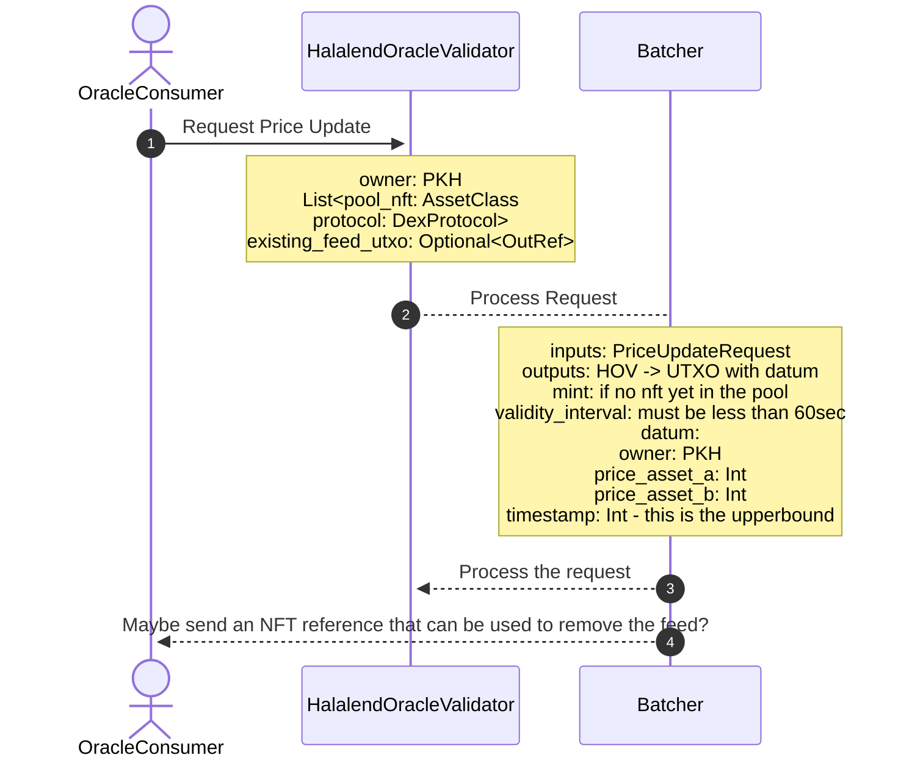

```mermaid
sequenceDiagram
    autonumber

    actor OC as OracleConsumer
    participant HOV as HalalendOracleValidator
    participant B as Batcher
    

    OC ->>+ HOV: Request Price Update
    Note over HOV: owner: PKH <br> List<pool_nft: AssetClass <br> protocol: DexProtocol> <br> existing_feed_utxo: Optional<OutRef>


    HOV --> B: Process Request
    Note over B: inputs: PriceUpdateRequest <br> outputs: HOV -> UTXO with datum <br> mint: if no nft yet in the pool <br> validity_interval: must be less than 60sec <br> datum: <br> owner: PKH <br> price_asset_a: Int <br> price_asset_b: Int <br> timestamp: Int - this is the upperbound
    B -->>+ HOV: Process the request
    B -->>+ OC: Maybe send an NFT reference that can be used to remove the feed?
```