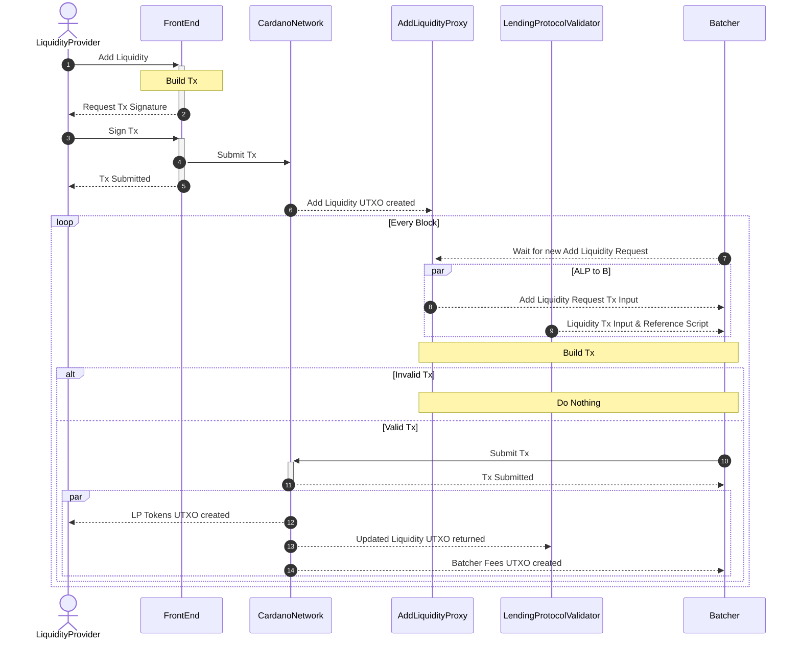

```mermaid
    %%{init: {'theme':'dracula'}}%%
    sequenceDiagram
        autonumber

        actor LP as LiquidityProvider
        participant FE as FrontEnd
        participant CN as CardanoNetwork
        participant ALP as AddLiquidityProxy
        participant LPV as LendingProtocolValidator
        participant B as Batcher
        
        LP ->>+ FE: Add Liquidity 
        Note over FE: Build Tx
        FE -->>- LP: Request Tx Signature
        LP ->>+ FE: Sign Tx
        FE ->> CN: Submit Tx
        FE -->>- LP: Tx Submitted
        CN -->> ALP: Add Liquidity UTXO created

        loop Every Block
            B -->>+ ALP: Wait for new Add Liquidity Request

            par ALP to B
                ALP -->> B: Add Liquidity Request Tx Input
                LPV -->> B: Liquidity Tx Input & Reference Script
            end

            Note over ALP, B: Build Tx

            alt Invalid Tx
                Note over ALP, B: Do Nothing
            else Valid Tx
                B ->>+ CN: Submit Tx
                CN -->>- B: Tx Submitted

                par 
                    CN -->> LP: LP Tokens UTXO created
                    CN -->> LPV: Updated Liquidity UTXO returned
                    CN -->> B: Batcher Fees UTXO created
                end
            end
        end
```