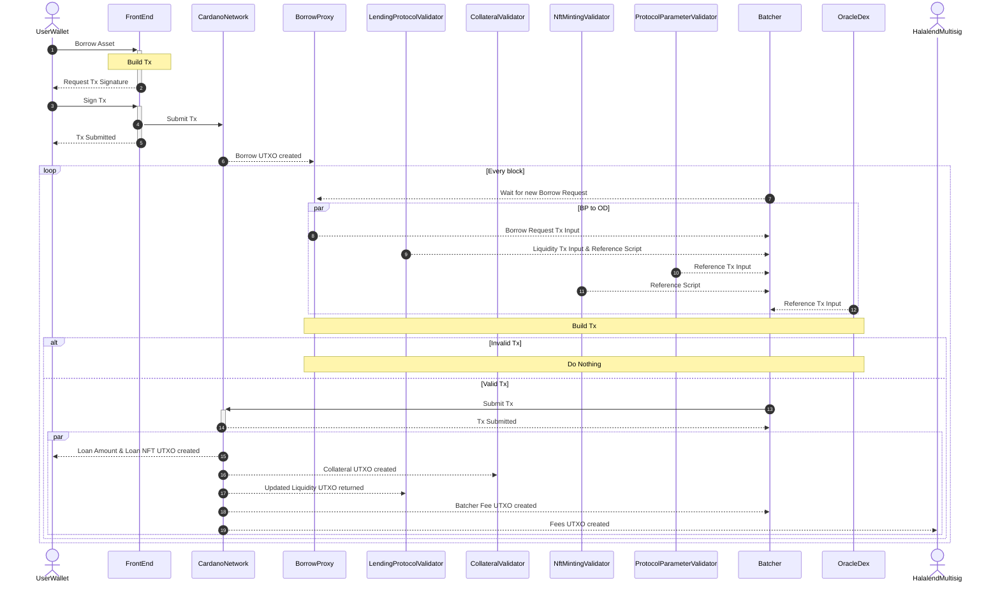

```mermaid
    %%{init: {'theme':'dracula'}}%%
    sequenceDiagram
    autonumber

    actor U as UserWallet
    participant FE as FrontEnd
    participant CN as CardanoNetwork
    participant BP as BorrowProxy
    participant LPV as LendingProtocolValidator
    participant CV as CollateralValidator
    participant NMV as NftMintingValidator
    participant PPV as ProtocolParameterValidator
    participant B as Batcher
    participant OD as OracleDex
    actor HM as HalalendMultisig
    

    U->>+FE: Borrow Asset
    Note over FE: Build Tx
    FE -->>- U: Request Tx Signature
    U ->>+ FE: Sign Tx
    FE ->> CN: Submit Tx
    FE -->>- U: Tx Submitted
    CN -->> BP: Borrow UTXO created

    loop Every block
        B -->>+ BP: Wait for new Borrow Request 

        par BP to OD
            BP -->> B: Borrow Request Tx Input
            LPV -->> B: Liquidity Tx Input & Reference Script
            PPV -->> B: Reference Tx Input
            NMV -->> B: Reference Script
            OD -->> B: Reference Tx Input
        end

        Note over BP, OD: Build Tx

        alt Invalid Tx
            Note over BP, OD: Do Nothing
        else Valid Tx
            B ->>+ CN: Submit Tx
            CN -->>- B: Tx Submitted

            par 
                CN -->> U: Loan Amount & Loan NFT UTXO created
                CN -->> CV: Collateral UTXO created
                CN -->> LPV: Updated Liquidity UTXO returned
                CN -->> B: Batcher Fee UTXO created
                CN -->> HM: Fees UTXO created
            end
        end
    end
```