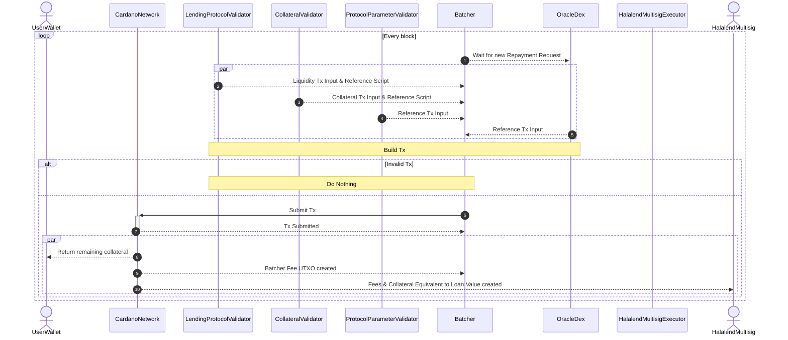

```mermaid
    %%{init: {'theme':'dracula'}}%%
    sequenceDiagram
        autonumber

        actor U as UserWallet
        participant CN as CardanoNetwork
        participant LPV as LendingProtocolValidator
        participant CV as CollateralValidator
        participant PPV as ProtocolParameterValidator
        participant B as Batcher
        participant OD as OracleDex
        participant HME as HalalendMultisigExecutor
        actor HM as HalalendMultisig
        

        loop Every block
            B -->>+ OD: Wait for new Repayment Request 

            par  
                LPV -->> B: Liquidity Tx Input & Reference Script
                CV -->> B: Collateral Tx Input & Reference Script
                PPV -->> B: Reference Tx Input
                OD -->> B: Reference Tx Input
            end

            Note over LPV, OD: Build Tx

            alt Invalid Tx
                Note over LPV, B: Do Nothing    
            else
                B ->>+ CN: Submit Tx 
                CN -->>- B: Tx Submitted

                par 
                    CN -->> U: Return remaining collateral
                    CN -->> B: Batcher Fee UTXO created
                    CN -->> HM: Fees & Collateral Equivalent to Loan Value created
                end
            end
        end 
```