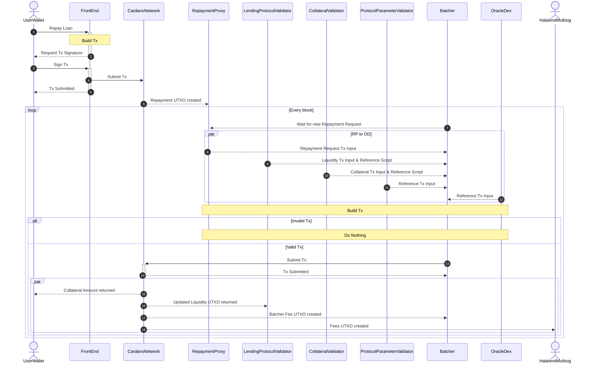

```mermaid
    %%{init: {'theme':'dracula'}}%%
    sequenceDiagram
        autonumber

        actor U as UserWallet
        participant FE as FrontEnd
        participant CN as CardanoNetwork
        participant RP as RepaymentProxy
        participant LPV as LendingProtocolValidator
        participant CV as CollateralValidator
        participant PPV as ProtocolParameterValidator
        participant B as Batcher
        participant OD as OracleDex
        actor HM as HalalendMultisig
        
        U->>+FE: Repay Loan
        Note over FE: Build Tx
        FE -->>- U: Request Tx Signature
        U ->>+ FE: Sign Tx
        FE ->> CN: Submit Tx
        FE -->>- U: Tx Submitted
        CN -->> RP: Repayment UTXO created

        loop Every block
            B -->>+ RP: Wait for new Repayment Request 

            par RP to OD
                RP -->> B: Repayment Request Tx Input
                LPV -->> B: Liquidity Tx Input & Reference Script
                CV -->> B: Collateral Tx Input & Reference Script
                PPV -->> B: Reference Tx Input
                OD -->> B: Reference Tx Input
            end

            Note over RP, OD: Build Tx

            alt Invalid Tx
                Note over RP, OD: Do Nothing
            else Valid Tx
                B ->>+ CN: Submit Tx
                CN -->>- B: Tx Submitted

                par 
                    CN -->> U: Collateral Amount returned
                    CN -->> LPV: Updated Liquidity UTXO returned
                    CN -->> B: Batcher Fee UTXO created
                    CN -->> HM: Fees UTXO created
                end
            end
        end 
```